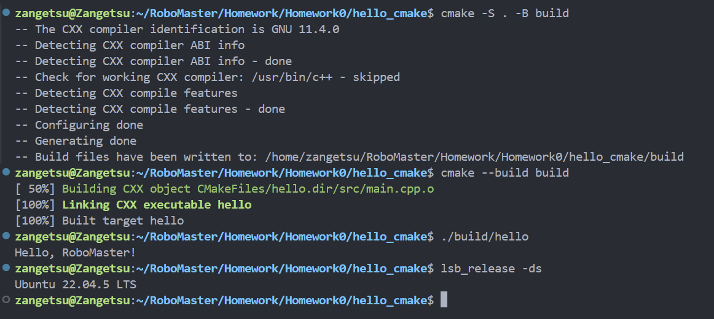

# Hello CMake
## 环境
- Ubuntu 22.04.5 LTS
- g++ 11.4.0
- CMake 3.22.1
- git 2.34.1
- GCC 11+

## 构建命令
```bash
cmake -S . -B build
cmake --build build
```

## 运行命令
```bash
./build/hello
```

## 预期输出
```bash
Hello, RoboMaster!
```
## 运行成功截图
